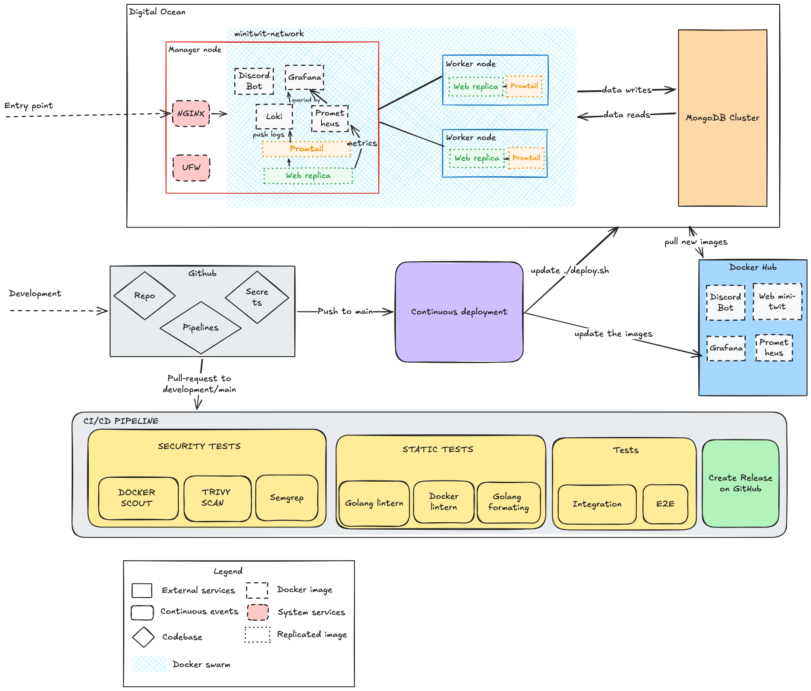

  

<h1 align="center">Report by group p "EastOps"</h1>

<ul align="right" style="list-style-position: inside;">
  <li><strong>Anton Yakovenko</strong> anya@itu.dk</li>
  <li><strong>Janusz Bekas</strong> jdbe@itu.dk</li>
  <li><strong>Mengdi Liao</strong> menl@itu.dk</li>
  <li><strong>Viktor Horvath</strong> vhor@itu.dk</li>
</ul>

## Introduction

Itu-minitwit is an evolved version of the MiniTwit project, originally written in Python and Flask. We re-wrote it in Go using the Gorilla web toolkit, with MongoDB as the database. Loki, Prometheus, Promtail, and Grafana form the monitoring stack.

The codebase lives on GitHub and uses GitHub Actions for the CI/CD pipeline. DigitalOcean hosts our virtual machines and managed database.

## System perspective

  

<em>System architecture view</em>

The production runtime is Docker Swarm on DigitalOcean. The Swarm has one manager node, minitwit, and two worker nodes, minitwit-web-1 and minitwit-web-2. The remote stack consists of webserver, prometheus, grafana, loki, promtail, and discordbot services on the overlay network minitwit-network. Manager node consists of a monitoring stack (prometheus, grafana, loki, a promtail replica and webserver replica). Worker nodes have webserver replicas and promtail replicas.

The infrastructure itself is provisioned by Terraform (`infra/`). A single `terraform apply` creates the three droplets with Docker pre-installed via cloud-init, a DigitalOcean Cloud Firewall, a managed MongoDB cluster, and a DO Project to group them. Two `null_resource` blocks then run `swarm-setup.sh` to initialize the Swarm and `deploy-stack.sh` to upload the stack files and trigger `deploy.sh` on the manager.

The web application and Discord bot both connect to the database through `MONGO_URI`.

Monitoring is implemented using Grafana for visual display of graphs and logs. Logs originate in the webserver containers; Promtail runs as a global Swarm service and ships Docker container logs to Loki. Graphs are produced by Prometheus, which scrapes the webserver's metrics endpoint and feeds Grafana for visualization.

Necessary environment variables are stored in GitHub Secrets.

## Dependencies

### Higher-Level Dependencies

- **DigitalOcean Droplets** — Cloud VMs that host the production Docker Swarm nodes.
- **DigitalOcean Managed MongoDB** — Hosted production MongoDB database used by the app and bot.
- **Docker** — Runs the application and infrastructure services in containers.
- **Docker Compose** — Defines and runs the local development environment.
- **Docker Swarm** — Orchestrates the remote production stack across multiple droplets.
- **Docker Hub** — Registry where production images are pushed and pulled from.
- **Vagrant** — Current tool for provisioning DigitalOcean droplets.
- **vagrant-digitalocean** — Vagrant provider plugin/box for creating DigitalOcean droplets.
- **GitHub Actions** — CI/CD platform for tests, static analysis, image builds, releases, and deployments.
- **Nginx** — Reverse proxy in front of the app and Grafana.
- **Certbot** — Automates Let's Encrypt certificate setup and renewal.
- **Let's Encrypt** — Issues TLS certificates.
- **DigitalOcean Cloud Firewall** — Manages perimeter network rules for the droplets (replaces the per-host UFW from the Vagrant era).
- **Prometheus** — Collects application and service metrics.
- **Grafana** — Displays dashboards for metrics and logs.
- **Loki** — Stores and queries logs.
- **Promtail** — Collects container logs and ships them to Loki.
- **rsyslog** — Older/auxiliary centralized log collection component.
- **Firefox / geckodriver / Selenium** — Runs browser-based UI tests.
- **Docker Scout** — Scans Docker images for vulnerabilities.
- **Trivy** — Performs container vulnerability scanning.
- **Semgrep** — Static analysis for security/code patterns.
- **CodeQL SARIF upload** — Uploads scan results to GitHub code scanning.
- **golangci-lint** — Runs Go linting.
- **Hadolint** — Lints Dockerfiles.

### Container / Image Dependencies

- `mongo:8.0` — Local MongoDB database image.
- `grafana/grafana:12.1` — Base image for the custom Grafana image.
- `prom/prometheus:v3.5.1` — Base image for the custom Prometheus image.
- `grafana/loki:latest` — Loki log storage/query service image.
- `grafana/promtail:latest` — Promtail log shipper image.
- `ubuntu:24.04` — Base image for the rsyslog container.
- `golang:1.25.10` — Build image for compiling the Go web app.
- `alpine:3.23` — Lightweight runtime image for the Go web app.
- `pandoc/latex:3.6` — CI image used to build the report PDF.
- `curlimages/curl` — Small image used for HTTP checks in older/local helper flows.

### Main Go App Dependencies

- `github.com/gorilla/mux` — HTTP router for app routes.
- `github.com/gorilla/sessions` — Cookie/session management.
- `github.com/prometheus/client_golang` — Exposes Prometheus metrics from the app.
- `go.mongodb.org/mongo-driver` — MongoDB client driver.
- `golang.org/x/crypto` — Crypto utilities, including password hashing support.

### Discord Bot Dependencies

- `github.com/bwmarrin/discordgo` — Discord API client library.
- `go.mongodb.org/mongo-driver` — MongoDB client driver used by the bot.

### Important Go Indirect Dependencies

- `github.com/gorilla/securecookie` — Secure cookie encoding used by Gorilla sessions.
- `github.com/gorilla/websocket` — WebSocket support, used indirectly by Discord integration.
- `github.com/prometheus/client_model` — Prometheus metric data model.
- `github.com/prometheus/common` — Shared Prometheus helpers.
- `github.com/prometheus/procfs` — Reads Linux process metrics for Prometheus.
- `github.com/klauspost/compress` — Compression support.
- `github.com/golang/snappy` — Snappy compression support, used by MongoDB-related code.
- `github.com/xdg-go/scram` — SCRAM authentication support for MongoDB.
- `github.com/xdg-go/pbkdf2` — Password-based key derivation used in auth flows.
- `github.com/xdg-go/stringprep` — String preparation used in authentication protocols.
- `google.golang.org/protobuf` — Protocol Buffers support.
- `golang.org/x/sys` — Low-level OS/system calls.
- `golang.org/x/text` — Text encoding and normalization utilities.
- `golang.org/x/sync` — Extra concurrency helpers.
- `golang.org/x/net` — Extended networking libraries.

### Python / Test Dependencies

- `pytest` — Python test runner.
- `pymongo` — Python MongoDB client used by tests.
- `selenium` — Browser automation for UI tests.
- `requests` — HTTP client used by simulator/test tooling.

### GitHub Actions Dependencies

- `actions/checkout` — Checks out repository code in CI.
- `docker/login-action` — Logs CI into Docker Hub.
- `docker/setup-buildx-action` — Enables Docker Buildx in CI.
- `docker/build-push-action` — Builds and pushes Docker images.
- `actions/setup-go` — Installs/configures Go in CI.
- `actions/setup-python` — Installs/configures Python in CI.
- `actions/upload-artifact` — Uploads generated artifacts like the report PDF.
- `browser-actions/setup-firefox` — Installs Firefox for UI tests.
- `docker/scout-action` — Runs Docker Scout vulnerability checks.
- `aquasecurity/trivy-action` — Runs Trivy scans.
- `golangci/golangci-lint-action` — Runs Go linting in CI.
- `returntocorp/semgrep-action` — Runs Semgrep static analysis.
- `softprops/action-gh-release` — Creates GitHub releases.
- `zwaldowski/semver-release-action` — Handles semantic version release automation.
- `zwaldowski/match-label-action` — Checks labels used for release/version decisions.

## Process perspective

To manage the workflow, we created a Discord channel where we discuss ideas, raise current problems, and decide how to solve them. During the evolution of the project, we tracked bugs as GitHub issues, which gave us a clear view of open work and let us assign owners for each fix. Once a solution was ready, the developer opened a pull request from their feature branch into `development`, where the CI/CD pipeline ran the full test suite. After CI passed, the PR required at least one review from another team member before it could be merged. We aimed to open a `development` → `main` PR every week to keep a steady cadence of weekly releases. Branch naming conventions are documented in the project README.

## CI/CD Pipeline: Stages and Tools

Our CI/CD pipeline ensures security and quality at every stage before deployment. The automated workflow consists of four main stages.

### 1. Security Tests

First line of defense, scanning the code and environment for vulnerabilities.

- **Semgrep (SAST)** — Scans the raw source code to detect bad coding patterns, hardcoded secrets, and OWASP Top 10 vulnerabilities.
- **Trivy** — Scans project dependencies and OS packages for known vulnerabilities (CVEs).
- **Docker Scout** — Analyzes the compiled Docker images, generating an SBOM and ensuring the final artifact is free of critical container vulnerabilities.

### 2. Static Tests

Enforces code quality, readability, and best practices without running the application.

- **Golang Linter** — Detects syntax errors, dead code, and potential bugs in the Go source code.
- **Docker Linter** — Validates Dockerfile configurations to ensure images are optimized and follow security best practices.
- **Golang Formatting** — Ensures consistent code styling across the team.

### 3. Dynamic Tests

Runs the compiled application to verify system behavior.

- **Integration Tests** — Runs the provided simulator, testing thousands of user interactions with our application.
- **End-to-End (E2E) Tests** — Simulate real user interactions from start to finish, ensuring the entire ecosystem (UI, backend, and DB) functions as expected.

### 4. Deployment and Release

Triggered only when all previous stages pass successfully.

- **Create Release on GitHub** — The pipeline automatically generates a new version tag (e.g. `v1.0.2`); versions are saved in our repo, so if we ever need to roll back to a previous deployment we can do so easily.

### Monitoring

- Response time of different endpoints across percentile methodologies (P50, P95, P99 latency).
- Total incoming HTTPS requests for endpoints.
- Overall error rate, plus 4xx and 5xx responses per endpoint.
- Request / success / error rate per endpoint.
- Grafana alert system that posts to our Discord channel when the app is down or total error rate exceeds 10%.

### Logging

We log failures for different endpoints inside webserver containers. Promtail tails the Docker container logs and ships them to Loki, where Grafana queries and visualizes them.

### Security

- **DigitalOcean Cloud Firewall (Perimeter Defense)** — A managed firewall at the cloud-provider level denies all external traffic by default. Only ports 22 (OpenSSH), 80 (HTTP), and 443 (HTTPS) are publicly reachable; swarm-internal ports (2377, 7946, 4789) are restricted to droplets carrying the `minitwit` tag.
- **Nginx & HTTPS** — Nginx acts as a reverse proxy, buffering the public internet from our internal services. All data in transit is fully encrypted using HTTPS (SSL/TLS).
- **Password Hashing** — User credentials are cryptographically hashed before being stored in the database, ensuring no plaintext passwords are ever saved.
- **Automated CI/CD Scans** — Our DevSecOps pipeline actively blocks vulnerabilities before deployment using **Semgrep** (source code analysis), **Trivy** (dependency scanning), and **Docker Scout** (container image CVEs).
- Our Docker container images run as a non-root user, with the exception of Promtail — it needs elevated rights to read logs from other containers.

### Scaling and Availability

We use Docker Swarm to scale the application horizontally. Rolling updates keep downtime as low as possible during deploys: 3 webserver replicas plus one Promtail replica per node for log collection.

## Current state of the system

We ran CI's static-analysis stack (golangci-lint, hadolint, Trivy, Semgrep) against `development` on 2026-05-17.

| Tool | Scope | Result |
|---|---|---|
| golangci-lint | `src/` | 0 issues |
| golangci-lint | `src/bot/` | 3 errcheck issues |
| hadolint | 6 Dockerfiles | 0 issues |
| Trivy — CVEs | both `go.mod` | 0 |
| Trivy — Dockerfile misconfig | 6 Dockerfiles | 4 HIGH, 6 LOW |
| Trivy — secrets | tracked tree | 0 |
| Semgrep (364 rules) | 93 files | 9 blocking |

**In short.** 3 of the 9 Semgrep findings are false positives (MD5 only for Gravatar URLs, `http.ListenAndServe` runs behind nginx TLS, the gorilla/sessions cookie is set with `Secure: os.Getenv("COOKIE_SECURE") != "false"`). One is in test-fixture code. The remaining 5 are real: flash-message cookies in `helpers/flashes/flashes.go` lack `HttpOnly`/`Secure`, and the rsyslog Dockerfile is missing a `USER` directive.

## Reflection Perspective

### Evolution and Refactoring

The app evolved continuously. First we rewrote MiniTwit in Go and MongoDB. Then we introduced the first version of our CI/CD pipeline, which only built and published the latest version of the app to the DigitalOcean host. Next we improved the codebase by restructuring the project, adding missing features, and implementing new ones. We later expanded the CI/CD pipeline to include various security and quality tests. Most recently, we migrated infrastructure provisioning from a Vagrantfile + shell scripts to Terraform, replacing imperative VM creation with a declarative IaC setup that brings up droplets, Cloud Firewall, managed MongoDB, the Swarm bootstrap, and the full app deploy in a single `terraform apply`.

### Operation and Maintenance

After encountering our first errors, we added a custom logging system that collected all errors caught inside the handler and stored them in separate files. Later, we transitioned to specialized technologies, using Promtail to collect log lines from different containers and Loki to store them.

### Encountered Problems

We encountered multiple problems during development and evolution. The main ones:

- **Multi-day outage from DB non-indexing** — Lack of indexes caused the droplet to silently run out of memory and crash. We didn't notice for 4–5 days.
- **MongoDB ransomware attack** — MongoDB was reachable from outside the container host on port 27017 with no root username/password configured. A bot attack wiped some tables.
- **Base image selection** — Some barebones Linux distros didn't have `curl` available, which broke the CI/CD pipeline.
- **Swarm creation mishap** — We forgot to add additional droplets on DigitalOcean and mixed up network and volume names, causing a 30-minute downtime.
- **Volume export issues in early logging** — Our first logging system couldn't export logs outside the container. Rather than fixing it, we moved to Promtail and Loki.
- **Testing CI/CD safely** — Some CI/CD changes couldn't be tested directly in the main repository because they need teammate approval, so we used a separate sandbox repo with full rights.
- **Terraform `cloud-init` self-deadlock** — `cloud-init status --wait` was being called from inside `runcmd`, so cloud-init was waiting on itself. Docker never installed and the Swarm bootstrap hung for ~45 minutes before we caught it.
- **DigitalOcean Terraform provider MongoDB-user bug** — Provider v2.86 doesn't send the `user_settings` field that the MongoDB API now requires, so `digitalocean_database_user` fails on apply. We worked around it by using the cluster's auto-created `doadmin` user instead of a custom one.

### Use of Generative AI

**Tools used:**

- **Codex 5.5** — Review of our Docker stack.
- **Claude 4.7 and Gemini** — Code review, troubleshooting, and explaining concepts we couldn't solve on our own.
- **GitHub Copilot** — Coding suggestions during day-to-day work.

**Reflections on the work process:**

Generative AI significantly supported our workflow. With these tools, our project accelerated noticeably — especially when we made errors and the AI models were able to detect them and suggest repair steps. They also helped us understand new concepts from lectures and exercises. We remained cautious and manually verified suggestions, as the models occasionally lacked the full context of our specific system architecture.
